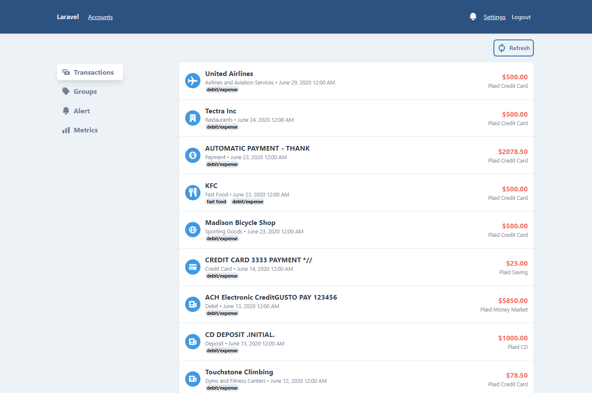
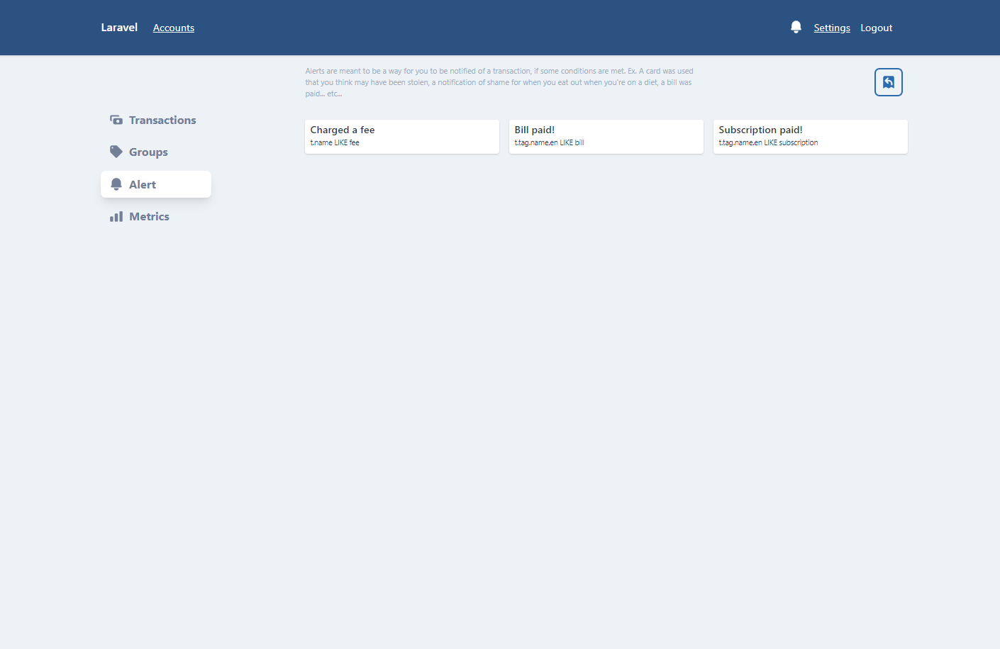
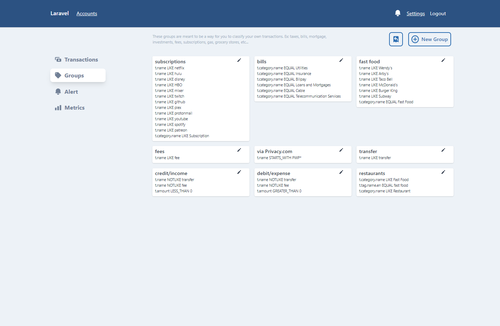

# finance


A self hosted app to help you get a better understanding of your finances.
 - [screenshots](#screenshots)
 - [Installing/Setting up](#installing-setting-up)
 - [Cron Jobs](#cron-jobs)
 
 
# Installing/Setting up
At the moment, this project is configured to be used from docker containers. You may use non-docker versions of the software, but at the moment that's undocumented.

# Features
 - Group transaction by a set of conditions.
 - Send alerts to Discord, Slack, Webhooks, email, Nexmo, and In-site notifications!
 - Sync older transactions
 - Graph your groups and compare numbers vs a previous time period (a trend)
 - Add together all your transactions in a time period (a metric)
 - Can automatically sync your transactions

### Configuration
First and foremost you must have a [Plaid account](https://plaid.com). Once you have your account you'll need to copy your [`development` tokens](https://dashboard.plaid.com/overview/development).

You'll then need to go to your `.env` file in the root of this project (or copy the `.env.example` file if the`.env` file doesn't exist) and add the following values.
```
PLAID_ENV=development
PLAID_PUBLIC_KEY=
PLAID_SECRET=
PLAID_CLIENT_ID=
```
And then fill in your plaid values.

### Requirements
  - MySql
  - PHP >=7.4
  - Redis (for queues and caching)
### Using Docker "Quick Setup"
```bash
docker-compose up --build -d
```
Which will build the containers, and start them daemonized (in the background)

(If your nginx container won't start, be sure you don't have any other programs using port 80)

 - Install the composer dependencies `docker exec -it finance-php composer install`
 - Install the npm/yarn dependencies `docker exec -it finance-node npm install` or `yarn` (Yes you need this on your host computer for now.)
 - Build the assets `docker exec -it finance-node npm run production`
 - Start the job queue worker `docker exec -it finance-php php artisan queue:work`
 - Navigate to `127.0.0.1` (or localhost, or whatever IP you're using to host this app) and register an account. Then navigate to your `settings` page and link your bank account
 - Click the "refresh" icon next to your bank name. (Give it a few seconds to process, and click the button again.) You should then see your accounts populate under the bank name.
 - Click "Historical Sync" select your accounts, select your date, then sync. _The time it can take to pull these transactions will vary widely based on the number of transactions, and date you choose. For a date range spanning several years it can take up to 30 minutes to sync everything. You can watch the terminal where you have the queue worker running to know when the last job processes._ 
 
# Cron Jobs
If you can configure the Laravel task scheduler `php artisan schedule:run` then commands will be ran when they're suppose to.
```cron
* * * * * "docker exec -it finance_php_1 php artisan queue:work"
```
Or you can configure a manual cron job to run those commands.

# Screenshots
  
  
  
  

